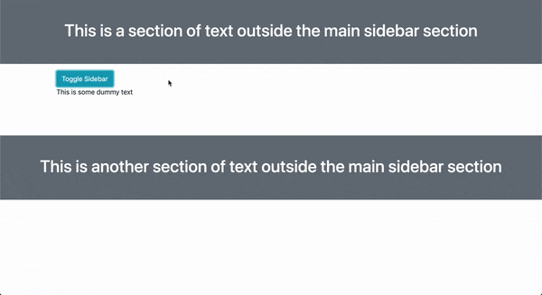

# Sidebar embedded in section of webpage

This is a very simple template demonstrating how to create an (animated) collapsible sidebar in a section of a webpage. It uses basic Bootstrap 4 classes, with some custom css and javascript.

Example of what it looks like:

